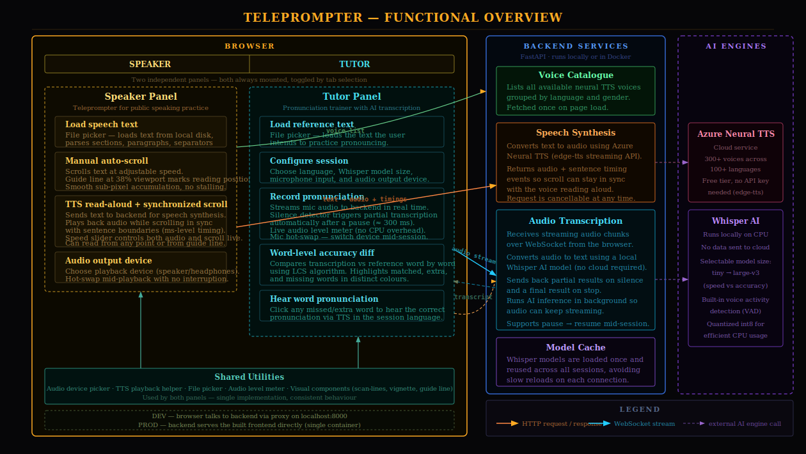

# Teleprompter

Browser-based teleprompter and pronunciation trainer for public speakers. Amber phosphor broadcast aesthetic.



## Stack

- **Frontend** — React 18 + Vite, inline CSS, Vitest unit tests
- **Backend** — FastAPI + `edge-tts` (TTS) + `faster-whisper` (speech recognition), served via `uvicorn`
- **Packaging** — Multi-stage Docker image (node build → python runtime)

## Panels

### Speaker

Teleprompter with smooth auto-scroll and TTS narration.

| Action | Keyboard | UI |
| --- | --- | --- |
| Play / Pause scroll | `Space` | PLAY button |
| Speak / Stop TTS | `T` | SPEAK button |
| Speed (scroll & TTS) | `↑` / `↓` (±0.1x) | Slider (0.1x – 3.0x) |
| Font size | `[` / `]` | A− / A+ buttons |
| Reset | `R` | RESET button |
| Mirror | `M` | MIRROR button |

Speed adjusts live during TTS playback — voice and scroll respond immediately. Select text before pressing T to speak only the selection. Text can be loaded from a file or pasted directly.

### Tutor

Pronunciation practice: load reference text, speak into the mic, compare your speech to the original with color-coded word-level diff.

- **Green** — correctly recognized words
- **Amber** — extra words (added/substituted)
- **Red strikethrough** — missing words (skipped)

Includes a chronometer that starts on first word and stops when finished. Whisper model and language are selectable. Mic and audio output can be switched live.

### Free Speech

Open-ended transcription without a reference text. Accumulates a running transcript across multiple recording sessions. Includes a chronometer and live audio level meter. Useful for rehearsing unscripted speeches.

## Run locally

```bash
# Backend (from backend/)
uv run uvicorn main:app --reload   # http://localhost:8000

# Frontend (from frontend/)
npm install
npm run dev                        # http://localhost:5173 (proxies /api to :8000)
npm test                           # unit tests
```

See [backend/README.md](backend/README.md) for API reference, audio pipeline details, and concurrency model.

## Run with Docker

```bash
docker build -t teleprompter .
docker run -p 8000:8000 teleprompter   # http://localhost:8000
```

## Speech file format

```text
## Section Title     → amber section header
**Bold line**        → emphasized text
---                  → visual spacer
Regular line         → normal paragraph
```

Files are loaded via the browser FileReader API — never uploaded to the server.
