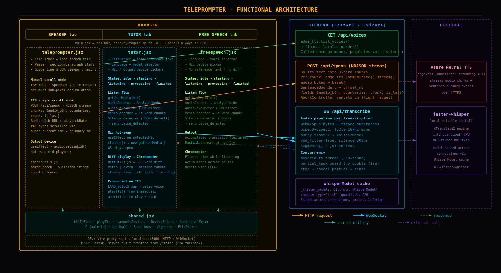
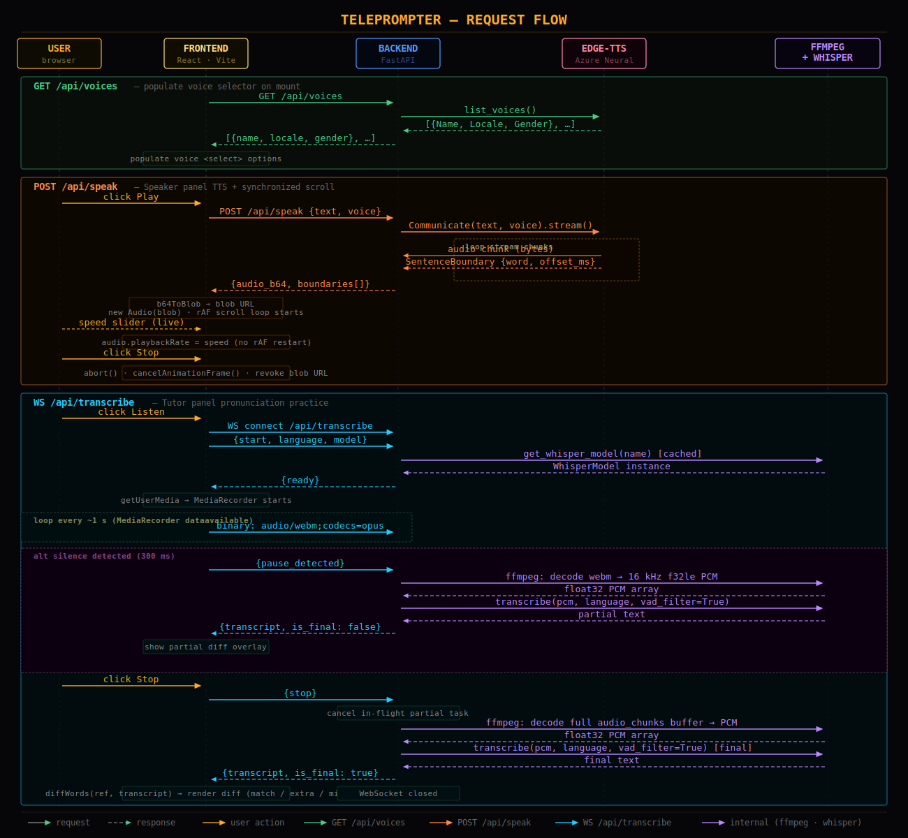

# Technical Architecture

## Overview

The app is a single-page React application backed by a FastAPI service. In development the frontend runs on Vite's dev server (`:5173`) and proxies `/api` requests to the backend (`:8000`). In production the backend serves the built frontend directly from `/static` — one container, one port.

Three zones communicate over HTTP and WebSocket:

| Zone | Technology |
| --- | --- |
| Browser | React 18, Vite, inline CSS |
| Backend | FastAPI, uvicorn, edge-tts, faster-whisper |
| AI engines | Azure Neural TTS (cloud), Whisper (local CPU) |

---

## Frontend

Both panels — **Speaker** and **Tutor** — are always mounted in the DOM. A tab bar toggles visibility with CSS, preserving all component state on switch.

### Speaker panel (`teleprompter.jsx`)

Loads a speech file via the browser's FileReader API (never uploaded). The file is parsed into typed items (section headers, paragraphs, spacers, bold lines) by `speechUtils.js`.

Two independent play modes share the same scroll container:

**Manual scroll** — a `requestAnimationFrame` loop reads `speedRef` (a ref, not state) so the loop never restarts on speed change. Sub-pixel amounts accumulate in `accumRef` and flush when ≥ 1 px, preventing stall at slow speeds.

**TTS + synchronized scroll** — POSTs text and voice to `/api/speak`, receives base64 audio and sentence boundary timestamps. The audio plays via a blob URL; a rAF loop maps `audio.currentTime` against the boundary list to keep `scrollTop` in sync sentence by sentence. Speed slider updates `audio.playbackRate` and the scroll interpolation coefficient live every frame without restarting the loop.

### Tutor panel (`tutor.jsx`)

State machine: `idle → starting → listening → processing → finished`.

The listen flow:

1. `getUserMedia` acquires the selected microphone.
2. `AudioContext → AnalyserNode` feeds `AudioLevelMeter`, which writes bar width and glow directly to the DOM via a ref — no React state, no re-renders at 60 fps.
3. `MediaRecorder` emits 1-second `audio/webm;codecs=opus` chunks sent as binary WebSocket frames.
4. A silence detector fires `{pause_detected}` after ≈ 300 ms of quiet, triggering a partial transcription from the backend.
5. On Stop the frontend sends `{stop}` and waits for the final transcript.

The received transcript is diffed word-by-word against the reference text (`diffUtils.js` — LCS algorithm) and rendered as matched / extra / missing tokens. Clicking a missed word calls `playTts` from `shared.jsx` to pronounce it via TTS in the session language.

### Shared utilities (`shared.jsx`)

Single implementations used by both panels: `b64ToBlob`, `playTts`, `useAudioDevices`, `DeviceSelect`, `AudioLevelMeter`, `FilePicker`, `ScanLines`, `Vignette`, color palette `C`.

---

## Backend (`backend/main.py`)

Three endpoints:

### `GET /api/voices`

Calls `edge_tts.list_voices()` and returns the list of available Azure Neural voices. Called once on page load to populate the voice selector.

### `POST /api/speak`

Calls `edge_tts.Communicate(text, voice).stream()`. Audio chunks are buffered into a `BytesIO`; `SentenceBoundary` events are collected (offset ÷ 10 000 → ms). Returns `{audio_b64, boundaries[]}` in a single JSON response. The request is cancellable via `AbortController` at any time.

### `WS /api/transcribe`

WebSocket session lifecycle:

1. Client sends `{type:"start", language, model}`.
2. Backend loads (or retrieves from cache) the requested `WhisperModel`.
3. Backend replies `{type:"ready"}` — client starts `MediaRecorder`.
4. Client streams binary audio chunks.
5. On `{pause_detected}`: backend pipes accumulated chunks through an `ffmpeg` subprocess (webm → 16 kHz f32le mono PCM), converts to a numpy float32 array, runs `WhisperModel.transcribe` in `asyncio.to_thread` (CPU-bound, non-blocking), and sends a partial transcript.
6. On `{stop}`: any in-flight partial task is cancelled; the full accumulated buffer is decoded and transcribed for the final result; WebSocket closes.

A `partial_task` guard prevents double-firing if a second pause arrives before the first inference completes.

**WhisperModel cache** — models are stored in a process-level dict keyed by model name (`tiny`, `small`, `medium`, …). `compute_type="int8"` keeps CPU usage manageable. The same instance is reused across all sessions.

---

## Request flow

The sequence diagram above traces all three API interactions end to end:

1. **GET /api/voices** — frontend → backend → edge-tts → response cascade back to populate the voice `<select>`.
2. **POST /api/speak** — user clicks Play → frontend POSTs text+voice → backend streams from Azure Neural TTS, collects audio and boundary events, returns them together → frontend builds blob URL, starts audio + rAF scroll loop → speed slider updates playback rate live → Stop aborts and cleans up.
3. **WS /api/transcribe** — user clicks Listen → WebSocket opens → model loaded (cached) → `{ready}` → 1-second audio chunks stream in → silence triggers partial ffmpeg+Whisper inference → partial diff shown → Stop cancels partial, runs final inference → final diff rendered → WebSocket closes.

---

## Deployment

**Dev** — two processes (`uvicorn` + `vite dev`), Vite proxies `/api` to `:8000`.

**Prod** — multi-stage Docker image: Node build stage compiles the frontend to `dist/`, Python runtime stage copies the output to `./static/`. FastAPI mounts `./static` as a `StaticFiles` route with an SPA fallback, so both API and frontend are served from a single container on port `8000`.
